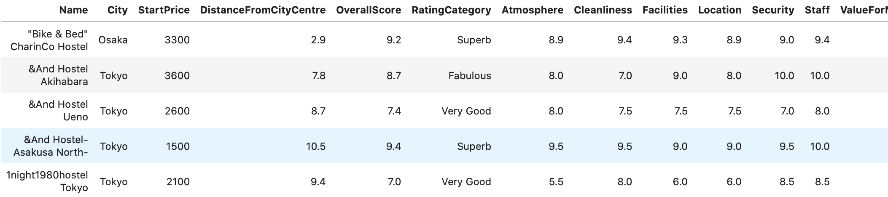
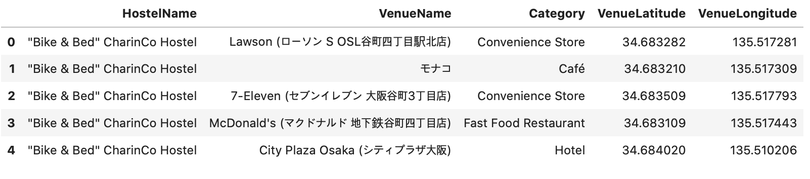
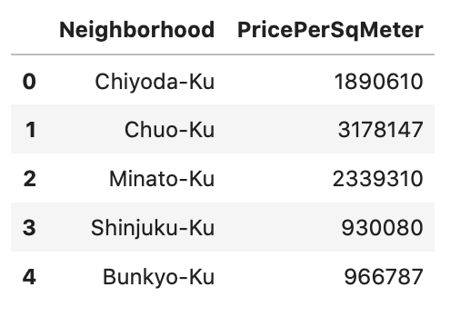

As someone who loves travelling, finding ways to save money and travel low-cost is essential. There's little to save while booking flights and I'd rather pay more to traveling comfortably on a 16Hr flight than try to save and wear myself down even before the trip begins! But we can always save a few bucks on accomodation.
<!--more-->

A hostel is a low-budget accommodation shared among travelers. Staying at hostels is an extremely affordable option for travelers. Not only that, It also gives you a chance to expereince which you would never at a hotel. I've found that experiencing hostel life one of the best ways to travel the world on a budget and here’s why:
1. You'll save a lot of money trust me.
2. Meet other like-minded travellers and make new friends around the world!
3. Most hostels organize lot of social activites

Hence, I selected this as a topic for my Capstone Project for IBM Data Sciene Professional Certificate. In this post, I'll give a summary of my findings from the project.
 
 

## Business Understanding
Hostel accomodation is a booming industry with the latest rise in tourism worldwide, especially in Asia. Over 20% of the total tourists worldwide are aged between 19-25. And around 80% of them prefer to spend less on accomodation by opting for hostels. This means the demand for hostels is only going to grow further and more people would want to get their legs in the game. 
- How should a new business person decide where to open a hostel?
- What factors should he look at before investing?
- Which neighborhood venues affect a user's rating for *location* of hostel?

At the same time, it is difficult for a travellers, especially first-timers, to select a hostel from among many options. Hostel reviews are subjective and differ from person-to-person and one cannot solely depend on them to make a decision. It is especially important to consider other aspects like price and neighborhood, which can greatly influence one's experience of the city/country.
I will try to answer the following questions 
- How does price vary with location?
- Where are the <i>'value of money'</i> hostels located?
- How does proximity to transportation affect hostel rating?
- Which hostels are most secure and where are they located?
- Suggest similar hostel but which cheaper price

Tourism in Japan in on a rise. It is expected that the number of foreign tourists coming to Japan will be increasing till 2020 when Olympic will be held in Tokyo. Hence, for this project, we will be looking at hostels in Japan, in particular, Tokyo.
 
 

## 2. Data Requirements
I analysed in this project : **Tokyo**.
Following are the datasets used in the project:

1. [Japan Hostel Dataset](https://www.kaggle.com/koki25ando/hostel-world-dataset)
2. [Hostel Neighborhood](https://developer.foursquare.com/docs/api)
3. [Tokyo Land Price](https://utinokati.com/en/details/land-market-value/area/Tokyo/)

#### Japan Hostel Dataset:
The original dataset on was taken from kaggle. Below is a snapshot of the dataset:   

 
 

#### Hostel Neighborhood:
This dataset contains all the neighborhoods or venues within 500m radius of a Hostel. Below is a snapshot of the dataset:   

 
 

#### Tokyo Land Price:
This dataset contains the locality name and the average price of land per square meter. Below is a snapshot:   

 
 
